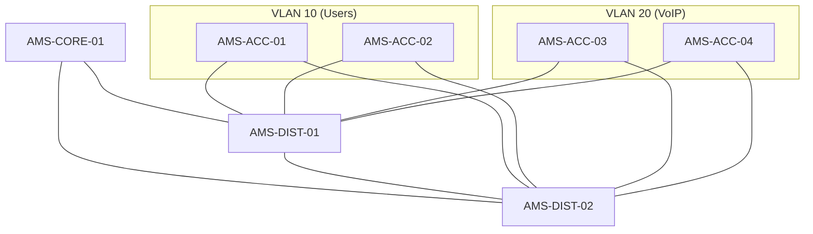

# Phase 2 Lab C: Mermaid Flowcharting

## Objective
Practice leveraging generative AI to build clean, maintainable logical network topology diagrams using the **Mermaid** script markup language. You will audit the AI's ability to automatically group network nodes into functional blocks and subgraphs.

## References & Documentation
- [Mermaid Flowchart Syntax Documentation](https://mermaid.js.org/syntax/flowchart.html) (Official Reference)
- [Mermaid Live Editor](https://mermaid.live/) (*⚠️ Security Warning: Unsafe/Forbidden for proprietary corporate data!*)

---

## Step-by-Step Lab Tasks

### Task 1: Generate a Multi-Tier Office Topology
Mermaid allows you to write markdown-like text representation that renders directly in modern markdown previewers (including VS Code, GitHub, and Azure DevOps).

1. Feed the following text-based office network topology description to **VS Code Copilot Chat**:
   ```text
   - 1 Core Switch named 'AMS-CORE-01'
   - 2 Distribution Switches named 'AMS-DIST-01' and 'AMS-DIST-02' connected in a mesh to Core
   - 4 Access Switches named 'AMS-ACC-01' through 'AMS-ACC-04' connected dual-homed to both Distribution Switches
   - VLAN 10 (Users) on ACC-01/02
   - VLAN 20 (VoIP) on ACC-03/04
   ```

2. Prompt the AI to generate a Mermaid flow diagram:
   > *"Act as a Network Documentation Specialist. Generate a clean top-down Mermaid flow diagram mapping this office subnet topology. Group Access switches by their VLAN allocations using Mermaid subgraphs. Use descriptive node IDs and labels, avoiding hyphens in the raw ID names to prevent syntax warnings. Output only the Mermaid script block."*

3. Copy the generated script block and render the preview in VS Code (using a Markdown preview extension) or paste it into the [Mermaid Live Editor](https://mermaid.live/).
4. Save the generated script as `topology.mmd` inside this lab directory.

### Task 2: Perform Output Quality Audits & Styling Comparison
Mermaid supports various layout orientations and visual styling themes that drastically affect diagram legibility, color contrast, and line routing.

1. **Inline/Render the Diagram**: Create a standard markdown code block in a new file named `comparison_notes.md` using the ` ```mermaid ` wrapper. Paste your generated script in it. Toggle the Markdown Preview inside VS Code (`Cmd+K V` on macOS) to see the flowchart render dynamically inline.
2. **Perform Layout & Quality Audit**: 
   - **Orientation Comparison**: By default, your flowchart uses Top-Down (`TD`). Modify the direction header to Left-to-Right (`LR`) by updating the start line to `graph LR` (or `flowchart LR`). Observe how this change alters subgraph alignments and connection crossings.
   - **Theme Comparison**: Apply different theme configuration directives at the top of your Mermaid code block to see color and aesthetic overrides:
     * Standard Theme: (Default behavior)
     * Forest Theme: Add `%%{init: {'theme': 'forest'}}%%` at the very first line of the Mermaid block.
     * Neutral Theme: Add `%%{init: {'theme': 'neutral'}}%%` at the very first line.
   - **Audit Connections & Aesthetics**: Compare both layout directions and theme overrides. Note connection crossovers (mesh tangling), label text contrast against node backgrounds, and clean subgraph spacing.
3. **Document Your Findings**: Document your visual audit observations directly below the inlined diagram inside `comparison_notes.md`. Your notes must explicitly cover:
   - **Layout Quality**: Evaluates orientation variations (e.g., `TD` vs `LR`) and connection routing/crossings.
   - **Color & Theme Options**: Discusses readability under different themes (e.g., standard, forest, neutral) and node background contrast.

### Task 3: Validate Your Diagram
1. Run the local self-checking validation tool in your terminal:
   ```bash
   python verify.py
   ```
2. Confirm that your diagram passes all of the required structural checks, and that your comparison notes are verified successfully!

### Task 4: Export to High-Quality PNG Images 📷
For inclusion in official reports, architecture designs, or team wikis, you will want to export your logical network flowchart as a high-resolution, crisp PNG image.

> ⚠️ **ENTERPRISE SECURITY & COMPLIANCE WARNING**
> **ALL public online rendering web services (such as the Mermaid Live Editor) are UNSAFE BY DEFINITION.** Uploading proprietary corporate topologies, internal hostnames, and VLAN structures to third-party public web servers leaks sensitive metadata and violates major industry compliance standard rules. Additionally, public cloud services are subject to data-harvesting or hidden licensing paywalls.
> 
> **For professional NetOps safety, always prioritize local, offline rendering using the Command Line (CLI) or trusted, offline local editor extensions.**

Choose one of the following methods, with **Method A (CLI)** being the highly preferred corporate-standard approach:

#### Method A: Using the Command Line (CLI - PREFERRED & SECURE)
The most secure and automated way to compile your Mermaid flowchart into a high-density, sharp PNG is using the local, offline Mermaid CLI compiler (`mmdc`).

1. **Install locally via Homebrew** (macOS standard):
   ```bash
   brew install mermaid-cli
   ```
2. **Compile your diagram**: Run the following command in your terminal to compile the diagram completely offline into a crisp `2000px`-wide image:
   ```bash
   mmdc -i topology.mmd -o topology.png -w 2000 -H 1500
   ```
3. *Alternative (ad-hoc without installation via local npx sandbox)*:
   ```bash
   npx -y @mermaid-js/mermaid-cli -i topology.mmd -o topology.png -w 2000 -H 1500
   ```

#### Method B: Using Local VS Code Extension (Secure & Offline)
1. Install the **Mermaid Preview** or **Markdown Preview Mermaid Support** extension.
2. Open `topology.mmd` in VS Code and toggle the preview panel (`Ctrl+Shift+V` or the preview icon).
3. Right-click the preview pane or click the export icon to **Save Image as PNG**. Save it as `topology.png` in this lab folder.

#### Method C: Using Mermaid Live Editor (GUI - UNSAFE / FORBIDDEN FOR PRODUCTION DATA)
*Only use this method for sandbox training or generic public examples. Do NOT upload proprietary network configurations.*
1. Go to the [Mermaid Live Editor](https://mermaid.live/).
2. Paste the contents of your `topology.mmd` file in the code pane on the left.
3. Click on the **Actions** tab (located in the bottom-left sidebar panel).
4. Click **PNG** under the download section to save a local copy. Rename it to `topology.png` and save it here.


### Task 5: Advanced Challenge — Redundant Spine-Leaf Datacenter Fabric 🏆

Now that you have mastered basic hierarchical structures, you are challenged to model a highly complex, redundant datacenter Spine-Leaf fabric spanning two datacenters.

#### Network Specifications:
- **Datacenters**: Two isolated datacenters: DC1 and DC2.
- **Spine Tier (Top Layer)**:
  - 2 Spines per DC:
    - DC1 Spines: `DC1-SP-01` and `DC1-SP-02`
    - DC2 Spines: `DC2-SP-03` and `DC2-SP-04`
- **Leaf Tier (Middle Layer - scaled by 4x)**:
  - 8 Leafs per DC (16 Leafs total):
    - DC1 Leafs: `DC1-LF-01` through `DC1-LF-08`
    - DC2 Leafs: `DC2-LF-09` through `DC2-LF-16`
  - **Uplink Redundancy**: Each Leaf switch is dual-homed, connecting to both Spine switches in its respective datacenter (e.g., `DC1-LF-01` connects to `DC1-SP-01` and `DC1-SP-02`).
- **VMware Host Tier (Bottom Layer - scaled by 4x)**:
  - 8 ESXi hosts per DC (16 hosts total), grouped into 4 separate clusters carrying functional VLAN partitions:
    - `DC1_Cluster_A` containing hosts `DC1-ESXI-01` through `DC1-ESXI-04` (carrying VLAN 100).
    - `DC1_Cluster_B` containing hosts `DC1-ESXI-05` through `DC1-ESXI-08` (carrying VLAN 101).
    - `DC2_Cluster_C` containing hosts `DC2-ESXI-09` through `DC2-ESXI-12` (carrying VLAN 200).
    - `DC2_Cluster_D` containing hosts `DC2-ESXI-13` through `DC2-ESXI-16` (carrying VLAN 201).
  - **Host Redundancy**: Each host is dual-homed, connecting to the two local Leaf switches in its datacenter (e.g., hosts `01` & `02` connect to leafs `01` & `02`; hosts `03` & `04` connect to leafs `03` & `04`; and so on).

#### Diagram Requirements:
1. **Output File**: Save your generated Mermaid diagram script to `spine_leaf.mmd` in the root of this lab directory.
2. **Alignment Constraints**: 
   - Spine switches must be positioned at the top and horizontally aligned.
   - Leaf switches must be horizontally aligned directly below the spine switches.
   - ESXi hosts must be positioned at the bottom, grouped horizontally inside their respective cluster subgraphs, and connected to their respective leaf switches.
   - *Hint: To force horizontal rows inside a Top-Down (`graph TD`) layout, group the nodes inside subgraphs and define `direction LR` inside each subgraph tier.*
3. **Line Routing & Thickness**: The diagram must use straight, geometric links to prevent the massive redundant mesh links from tangling, and the links must be visually thick for clear legibility:
   - Add the linear curve directive (`%%{init: {'flowchart': {'curve': 'linear'}}}%%`) at the very top of your diagram code block.
   - Enforce thick link lines globally by adding a default link styling rule at the end of your flowchart:
     ```text
     linkStyle default stroke-width:4px;
     ```
4. **Vibrant Styling**: Color-code the tiers (Red for Spines, Blue for Leafs, Green for ESXi compute nodes, soft pastel colors for subgraph bounds) using custom CSS `style` overrides at the bottom of your script to make the topology pop.

*Note: Run `python verify.py` to validate your advanced 4x scaled Spine-Leaf fabric diagram scorecard check! You can also check the reference diagram solution in `solutions/spine_leaf.mmd`.*

---

### Task 6: Study the Reference Design — Distributed Datacenter with DCI 📖

Now that you have built the basic spine-leaf topology, take a few minutes to study a more advanced **production-grade reference design** that introduces several new concepts:

1. **Open the reference design in VS Code Markdown Preview:**
   ```bash
   # In VS Code: navigate to the file, then press Cmd+K V (macOS)
   # File: labs/phase_2/lab_c_mermaid/solutions/spine_leaf_demo.md
   ```
   Or use the **Explorer panel** to open `solutions/spine_leaf_demo.md`, then press `Cmd+K V` to render the preview side-by-side.

2. **Observe the diagram and read what each section does:**

   | What you see | What it means |
   |---|---|
   | **Four horizontal bands** (top to bottom) | Each band is a `subgraph` row: `SPINE_ROW → DCI_ROW → LEAF_ROW → COMPUTE_ROW`. This forces all same-tier nodes across both datacenters to sit on the same horizontal level. |
   | **DC1 always left, DC2 always right** | Inside each tier row, two inner subgraphs (`DC1_*` and `DC2_*`) use `direction LR`, which pushes DC1 to the left half and DC2 to the right half automatically. |
   | **Purple rectangle nodes** (top row) | Spine switches — the Layer 3 fabric backbone, one pair per datacenter. |
   | **Orange hexagon nodes** (second row) | DCI Gateway Leaf switches — these are regular leaf switches promoted to a special Datacenter Interconnect role. The `{{...}}` hexagon shape visually signals their unique function. |
   | **Blue rectangle nodes** (third row) | Compute Leaf switches — the standard Top-of-Rack (ToR) switches that face the server tier. |
   | **Green cylinder nodes** (bottom row) | VMware ESXi hosts — the cylinder shape is the universal Mermaid notation for a server or database node. Grouped into vClusters with VLAN assignments. |
   | **Thick orange lines** in the middle | The DCI Backbone links. These use `== " DCI Backbone " ==>` (Mermaid thick-arrow syntax) and are overridden with `linkStyle 56,57,58,59 stroke:#FF6D00,stroke-width:6px` to make the inter-site links visually dominant. |
   | **All other grey links** | Normal fabric uplinks and downlinks, styled with `linkStyle default stroke:#37474F,stroke-width:3px`. The `default` keyword applies to all links before the specific overrides take effect. |

3. **Identify the key Mermaid v11 techniques used:**
   - `classDef` + `:::className` — mass-apply color and border styles to groups of nodes in a single declaration
   - `A & B --> C & D` — the multi-edge operator: one line expands to all `A×B → C×D` combinations (models dual-homed connectivity compactly)
   - `{{...}}` — hexagon shape for visually distinguishing nodes with a special role
   - `[("...")]` — cylinder shape for compute/server nodes
   - Nested `direction LR` inside `flowchart TB` — the key layout trick for forcing horizontal tier rows

4. **Reflection questions:**
   - Why are the DCI leaves positioned in their own tier row rather than mixed in with the regular compute leaves?
   - What would happen to the diagram layout if you removed `direction LR` from the inner DC subgraphs?
   - How does the `linkStyle` index numbering work, and why are the DCI links at indices 56–59?

5. **Live Showcase — See it rendered right here:**

```mermaid
%%{init: {'theme': 'dark', 'flowchart': {'curve': 'linear'}}}%%
flowchart TB

  classDef spine    fill:#4A148C,stroke:#CE93D8,stroke-width:3px,color:#fff,font-weight:bold
  classDef leafComp fill:#01579B,stroke:#4FC3F7,stroke-width:3px,color:#fff,font-weight:bold
  classDef leafDCI  fill:#BF360C,stroke:#FFAB40,stroke-width:4px,color:#fff,font-weight:bold
  classDef esxi     fill:#1B5E20,stroke:#81C784,stroke-width:2px,color:#E8F5E9

  subgraph SPINE_ROW["Spine Layer"]
    direction LR
    subgraph DC1_SP["DC1 — Spine"]
      direction LR
      D1SP1["DC1-SP-01"]:::spine
      D1SP2["DC1-SP-02"]:::spine
    end
    subgraph DC2_SP["DC2 — Spine"]
      direction LR
      D2SP1["DC2-SP-01"]:::spine
      D2SP2["DC2-SP-02"]:::spine
    end
  end

  subgraph DCI_ROW["DCI Gateway Leaf Layer"]
    direction LR
    subgraph DC1_DCI["DC1 — DCI Leaves"]
      direction LR
      D1DCI1{{"DC1-DCI-LF-01"}}:::leafDCI
      D1DCI2{{"DC1-DCI-LF-02"}}:::leafDCI
    end
    subgraph DC2_DCI["DC2 — DCI Leaves"]
      direction LR
      D2DCI1{{"DC2-DCI-LF-01"}}:::leafDCI
      D2DCI2{{"DC2-DCI-LF-02"}}:::leafDCI
    end
  end

  subgraph LEAF_ROW["Compute Leaf Layer"]
    direction LR
    subgraph DC1_LF["DC1 — Compute Leaves"]
      direction LR
      D1LF3["DC1-LF-03"]:::leafComp
      D1LF4["DC1-LF-04"]:::leafComp
      D1LF5["DC1-LF-05"]:::leafComp
      D1LF6["DC1-LF-06"]:::leafComp
    end
    subgraph DC2_LF["DC2 — Compute Leaves"]
      direction LR
      D2LF3["DC2-LF-03"]:::leafComp
      D2LF4["DC2-LF-04"]:::leafComp
      D2LF5["DC2-LF-05"]:::leafComp
      D2LF6["DC2-LF-06"]:::leafComp
    end
  end

  subgraph COMPUTE_ROW["VMware vSphere Compute"]
    direction LR
    subgraph DC1_VM["DC1 — VMware vSphere"]
      direction LR
      subgraph VA["vCluster A  |  VLAN 100-109"]
        direction LR
        D1E1[("ESXi-01")]:::esxi
        D1E2[("ESXi-02")]:::esxi
        D1E3[("ESXi-03")]:::esxi
        D1E4[("ESXi-04")]:::esxi
      end
      subgraph VB["vCluster B  |  VLAN 110-119"]
        direction LR
        D1E5[("ESXi-05")]:::esxi
        D1E6[("ESXi-06")]:::esxi
        D1E7[("ESXi-07")]:::esxi
        D1E8[("ESXi-08")]:::esxi
      end
    end
    subgraph DC2_VM["DC2 — VMware vSphere"]
      direction LR
      subgraph VC["vCluster C  |  VLAN 200-209"]
        direction LR
        D2E1[("ESXi-09")]:::esxi
        D2E2[("ESXi-10")]:::esxi
        D2E3[("ESXi-11")]:::esxi
        D2E4[("ESXi-12")]:::esxi
      end
      subgraph VD["vCluster D  |  VLAN 210-219"]
        direction LR
        D2E5[("ESXi-13")]:::esxi
        D2E6[("ESXi-14")]:::esxi
        D2E7[("ESXi-15")]:::esxi
        D2E8[("ESXi-16")]:::esxi
      end
    end
  end

  D1SP1 & D1SP2 --> D1DCI1 & D1DCI2
  D1SP1 & D1SP2 --> D1LF3 & D1LF4 & D1LF5 & D1LF6
  D1LF3 & D1LF4 --> D1E1 & D1E2 & D1E3 & D1E4
  D1LF5 & D1LF6 --> D1E5 & D1E6 & D1E7 & D1E8
  D2SP1 & D2SP2 --> D2DCI1 & D2DCI2
  D2SP1 & D2SP2 --> D2LF3 & D2LF4 & D2LF5 & D2LF6
  D2LF3 & D2LF4 --> D2E1 & D2E2 & D2E3 & D2E4
  D2LF5 & D2LF6 --> D2E5 & D2E6 & D2E7 & D2E8

  D1DCI1 == " DCI Backbone " ==> D2DCI1
  D1DCI1 == " DCI Backbone " ==> D2DCI2
  D1DCI2 == " DCI Backbone " ==> D2DCI1
  D1DCI2 == " DCI Backbone " ==> D2DCI2

  style SPINE_ROW    fill:#0A0118,stroke:#9C27B0,stroke-width:2px,color:#CE93D8
  style DCI_ROW      fill:#180500,stroke:#FF6D00,stroke-width:2px,color:#FFD54F
  style LEAF_ROW     fill:#001020,stroke:#0288D1,stroke-width:2px,color:#81D4FA
  style COMPUTE_ROW  fill:#001000,stroke:#43A047,stroke-width:2px,color:#A5D6A7
  style DC1_SP   fill:#150025,stroke:#CE93D8,stroke-width:1px,color:#E1BEE7
  style DC2_SP   fill:#150025,stroke:#CE93D8,stroke-width:1px,color:#E1BEE7
  style DC1_DCI  fill:#200600,stroke:#FFAB40,stroke-width:1px,color:#FFD54F
  style DC2_DCI  fill:#200600,stroke:#FFAB40,stroke-width:1px,color:#FFD54F
  style DC1_LF   fill:#001828,stroke:#29B6F6,stroke-width:1px,color:#81D4FA
  style DC2_LF   fill:#001828,stroke:#29B6F6,stroke-width:1px,color:#81D4FA
  style DC1_VM   fill:#001800,stroke:#66BB6A,stroke-width:1px,color:#A5D6A7
  style DC2_VM   fill:#001800,stroke:#66BB6A,stroke-width:1px,color:#A5D6A7
  style VA       fill:#001A00,stroke:#2E7D32,stroke-width:1px,color:#C8E6C9
  style VB       fill:#001A00,stroke:#2E7D32,stroke-width:1px,color:#C8E6C9
  style VC       fill:#001A00,stroke:#2E7D32,stroke-width:1px,color:#C8E6C9
  style VD       fill:#001A00,stroke:#2E7D32,stroke-width:1px,color:#C8E6C9

  linkStyle default stroke:#37474F,stroke-width:3px
  linkStyle 56,57,58,59 stroke:#FF6D00,stroke-width:6px,fill:none
```

<details>
<summary>Click to expand — Live Rendered Diagram</summary>



</details>

#### What Mermaid Does Well

- **`classDef` mass-styling** — define a color/border/font rule once (`classDef spine fill:#4A148C...`) and apply it to dozens of nodes with `:::spine`. No per-node `style` line required. LLMs generate this pattern reliably for up to ~30 nodes.
- **`A & B --> C & D` multi-edge operator** — one declaration expands to all source×target combinations. `D1SP1 & D1SP2 --> D1LF3 & D1LF4 & D1LF5 & D1LF6` generates 8 links. This is the most compact way to model dual-homed redundant connectivity in text form.
- **Nested `direction LR` inside `flowchart TB`** — each tier subgraph forces its contents horizontal while the overall top-to-bottom flow stacks the tiers vertically. This gives a professional network-diagram appearance purely from structural declarations.
- **Semantic node shapes** — `{{hex}}` for special-role switches, `[(cylinder)]` for servers — encode device *function* into the diagram geometry, not just the label. Readers immediately distinguish network from compute without reading every label.
- **`linkStyle` index-based targeted override** — `linkStyle default` sets a baseline for all 60 links, then `linkStyle 56,57,58,59` selectively overrides only the 4 DCI backbone links to vivid orange at 6px. Selective visual hierarchy without touching node styling.
- **Subgraph container colours via `style`** — each tier row and DC split gets its own background and border colour, creating a layered depth effect purely from CSS-style declarations.

#### Where Limitations Surface

- **`linkStyle` index counting is fragile and LLM-hostile.** The indices (56–59 for DCI links here) depend on the exact expansion order of every preceding `&` operator. If any link declaration is added, removed, or reordered — the DCI link indices shift silently and wrong links get coloured. LLMs almost always mis-count because they do not simulate `&` expansion. *Workaround: declare sensitive links last and always recount after any diagram edit.*

- **Layout non-determinism at 50+ nodes.** Mermaid's dagre layout engine is a graph solver, not a pixel-precise layout engine. At this scale (60 links, 4 nesting levels), the tier-row alignment works — but adding 1–2 more cross-tier connections can cause the engine to re-route edges through unexpected paths or collapse subgraph borders. LLMs cannot predict dagre's output. *Workaround: keep diagrams under ~40 nodes for reliable deterministic layout; switch to draw.io or Lucidchart for larger, pixel-precise L2/L3 blueprints.*

- **No custom icon support in `flowchart` mode.** The `architecture-beta` diagram type has native infrastructure icons (`server`, `cloud`, `database`) but its parser rejects hyphens in service IDs and has inconsistent VS Code extension support. `flowchart` supports no icons at all — only geometry (rectangles, hexagons, cylinders). LLMs may generate `architecture-beta` syntax with hyphenated IDs and cause parse errors. *Workaround: use the flowchart approach shown here; accept that icon support requires switching diagram type and validating parser compatibility first.*

- **Subgraph border labels clip at deep nesting.** With 4 levels of nesting (`SPINE_ROW → DC1_SP → node`), the inner subgraph title text can overlap with node labels or get clipped at certain viewport widths. This is invisible in source code and only shows at render time. LLMs cannot know the rendered text metrics. *Workaround: keep inner subgraph labels short (`DC1 — Spine` not `DC1 — Primary Site Spine Tier`) and test at the actual target viewport width.*

---


## Hints
*   **Syntax Warnings:** Mermaid can be sensitive to characters like hyphens inside node IDs (e.g., `AMS-CORE-01`). A common best practice is to declare the ID using underscores or camelCase, then add the label in quotes: `AMS_CORE_01["AMS-CORE-01"]`.
*   **Mesh Tangling:** If the lines are crossing awkwardly, change the direction from top-down (`TD` or `TB`) to left-to-right (`LR`) by updating the header to `graph LR`.
*   **Straight Lines (`curve: 'linear'`)**: By default, Mermaid curves lines organically around shapes. To get perfectly straight, crisp lines (like a formal engineering diagram), add the following initialization directive at the very first line of your Mermaid code block:
    ```text
    %%{init: {'flowchart': {'curve': 'linear'}}}%%
    ```
*   **Vibrant Custom Colors (`style` overrides)**: Make your diagram stand out visually by applying custom node color fills, solid borders, and white text. Add style rules at the end of your flowchart:
    ```text
    style Core fill:#D32F2F,stroke:#9E0000,stroke-width:2px,color:#fff
    style VLAN_10 fill:#E8F5E9,stroke:#81C784,stroke-width:1px
    ```
*   **Peekable Solution:** If you get stuck, you can inspect the reference flowchart under the [solutions/topology.mmd](solutions/topology.mmd) file and the visual audit in [solutions/comparison_notes.md](solutions/comparison_notes.md)!

---

## Expected Output

### Expected Mermaid Syntax:


### Quality Analysis
| Metric | Rating | Rationale |
| :--- | :--- | :--- |
| **Visual legibility** | High (auto-layout) | Nodes are automatically positioned, creating clean paths for standard topologies. |
| **LLM Success Rate** | **95% (Excellent)** | Very simple grammar; LLMs have high structural accuracy compiling flowcharts. |
| **Common Failure** | Dense mesh crossovers | Automatic algorithms scale poorly with extremely complex full-mesh physical routing. |

---

## Lab Retrospective

Take a moment to reflect on this lab session:
* **What went OK?**
* **What could be improved?**
* **Was the AI helpful?**
* **What prompting techniques proved most effective?**
