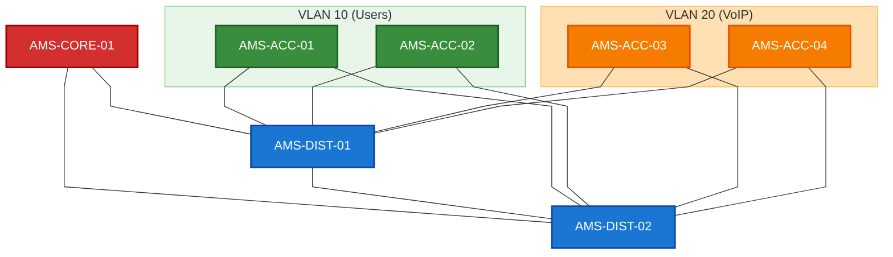

# Lab C: Mermaid Visual Styling & Layout Comparison

## Visual Styling and Layout Audit Findings

### 1. Layout Quality & Orientation Comparison (TD vs LR)
*   **Top-Down (`TD` or `TB`) Layout**: 
    *   *Quality & Legibility*: Outstanding logical flow. The multi-tier hierarchy (Core -> Distribution -> Access) is visually intuitive.
    *   *Connection Crossings*: Minimal line crossings. Because the access switches are cleanly partitioned into VLAN-specific subgraphs at the bottom of the diagram, the dual-homed redundant links flow straight up to the distribution layer, preventing mesh tangling.
*   **Left-to-Right (`LR`) Layout**:
    *   *Quality & Legibility*: The network layout stretches extremely wide. The subgraphs become vertically tall and horizontally narrow, which forces the access switches to align vertically, breaking the standard multi-tier architectural mental model.
    *   *Connection Crossings*: Increased line crossings in the middle distribution mesh since the redundant lines have to wrap around the tall subgraphs, causing visual overlap.
*   *Conclusion*: **Top-Down (`TD`)** is the superior layout orientation for hierarchical network tier topologies, whereas Left-to-Right (`LR`) is better suited for linear sequential pipelines or transactional flows.

### 2. Straight Lines vs Curved Lines (`curve` options)
*   **Curved/Orthogonal (Default `basis`)**: Mermaid default layout curves links programmatically around obstacles. While smooth, it can look organic or less like traditional network engineering topologies.
*   **Straight Lines (`curve: 'linear'`)**:
    *   *Aesthetics*: Completely straight lines from node to node.
    *   *Legibility*: Excellent! The connection routes look crisp, rigid, and strictly structural, matching the style of professional network diagrams created in Visio or Draw.io.
    *   *Conclusion*: **`curve: 'linear'`** is highly recommended for structured network meshes to enforce straight, neat links and eliminate unnecessary curves.

### 3. Color & Theme Customization (Vibrant Styles)
*   **Theme Options (Forest vs Neutral)**: High-level themes like Neutral give clean white backgrounds, whereas Forest introduces soft green accents.
*   **Custom CSS Styling Overrides (`style`)**:
    *   *Aesthetics*: Rather than relying solely on global themes, you can selectively define `style <NodeID> fill:<hex>,stroke:<hex>,stroke-width:2px,color:<text_color>`.
    *   *Vibrancy & Contrast*: We can color each tier differently: **Core is Red** (high importance), **Distribution is Blue** (transit tier), and **Access is Green/Orange** based on their functional VLANs. 
    *   *Legibility*: Adding solid custom fills and dark borders guarantees nodes pop visually, dramatically increasing the diagram's aesthetic wow-factor and readability.
*   *Conclusion*: Combining **custom style rules** with **straight linear curves** produces a state-of-the-art, colorful logical topology mapping.
